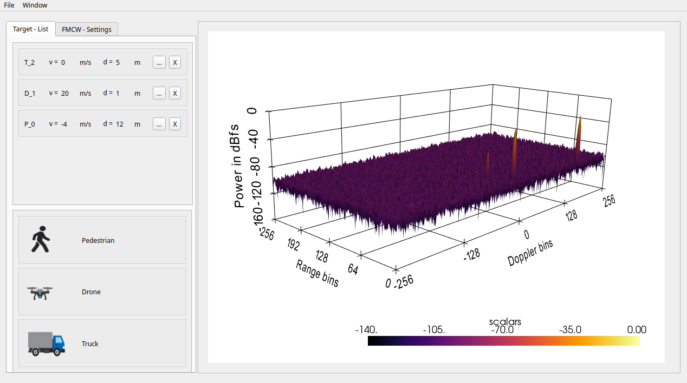

# FMCW Radar Simulator UI

---
## Description 

This project is an open‑source FMCW radar simulation user interface written in Python with QT PySide6.

## Documentation

A complete documentation can be found at
---

## Preview

## Version

-   0.1
    -   Initial Release

## Acknowledgments

-   **PySide6** <https://www.qt.io/development/qt-framework/python-bindings>
